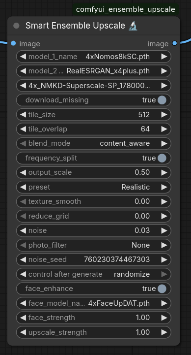
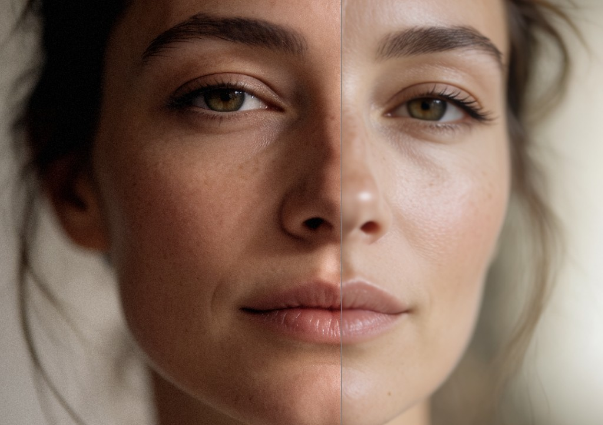
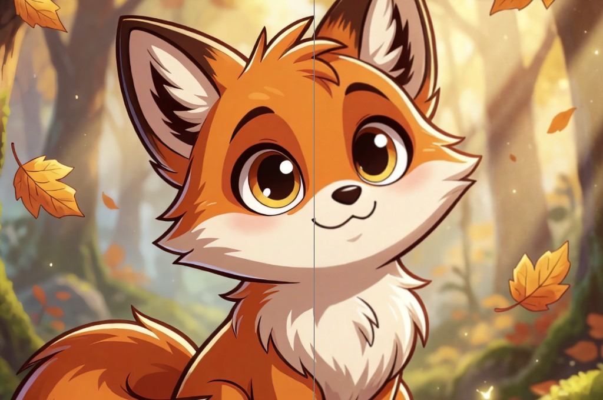
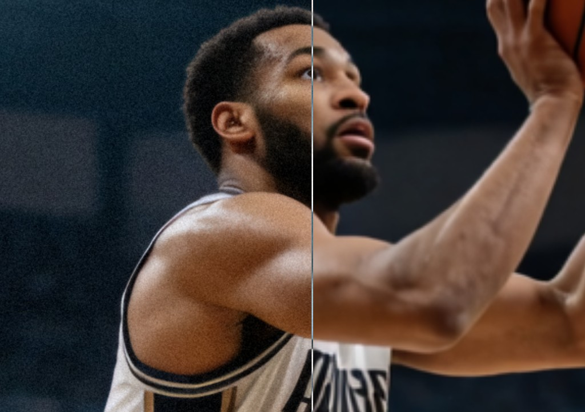

# Smart Ensemble Upscale

One upscaler always hands you its mistakes. This one runs up to three and keeps only what each does well: sharp edges, clean flat areas, and the color of the original picture. Presets are ready for realistic photos, anime, and cartoons. Grain, photo filters, and texture controls are there when the picture still needs a finish.



## Comparisons

Each picture is split down the middle. One side is the original, the other is upscaled.







A ComfyUI node that upscales one image with one to three ESRGAN models and puts the result back together so color and detail do not cancel each other out.

Find it under **image/upscaling** as **Smart Ensemble Upscale**.

## What it does

The models are chosen from dropdowns. The lists show every file already in `models/upscale_models`, including your own. A preset fills the three models and the look for that kind of picture. **Realistic** is the default: 4xNomos8kSC, RealESRGAN_x4plus, and 4x_NMKD-Superscale, with a light grain. The first model sets the scale, usually 4×. One model skips the blend.

The image is split into tiles so it fits in VRAM. Tile overlaps crossfade color and tone only. Detail comes from the nearer tile center. The two details blend only where those tiles nearly tie.

With more than one model, edges keep detail from the first model. The edge map is taken from that first model. Flat areas take detail from the smoothest model. Color is crossfaded. Detail blends only where the two leading models nearly tie. Other blend modes are average, sharpest, and smoothest.

`frequency_split` is on by default. The original is enlarged with bicubic and blurred with the same cutoff that is removed from the model result. Color and tone stay from the original. Detail comes from the models.

Final size is `original × model scale × output_scale`. The default `output_scale` of **0.5** turns a 4× model into a 2× image by averaging each 2×2 block. **1.0** keeps the full enlargement.

## Reconstruction

Let \(I\) be the source and \(U^{(i)}\) an integer-scale ESRGAN. The working grid is \(s\) times the input, where \(s\) is the scale of the first model. If `output_scale` \(\alpha < 1\), that grid is then area-resampled: each output pixel is the mean of the source pixels that cover it. \(\alpha = 1/2\) on a \(4\times\) model is a \(2\times 2\) box mean.

Bands use a separable Gaussian \(G_\sigma\), \(\sigma = 1.5\) input pixels, kernel radius \(\lceil 3\sigma \rceil\), reflection padding. On the upscaled grid the same cutoff is \(\sigma_s = 1.5\, s\):

\[
L(X) = G_{\sigma_s}(X), \qquad H(X) = X - L(X).
\]

With frequency split on, color comes from a bicubic enlarge of the source and detail from the model, at one shared cutoff:

\[
Y = L(\mathrm{bicubic}_s(I)) + H(U_s(I)).
\]

\(L + H\) is a partition, so the cutoff neither doubles detail nor leaves a hole. One model stops here.

With several models, each output is resampled to the first model's size. The edge map \(E \in [0,1]\) is the Sobel magnitude of the luminance of \(U^{(1)}\), divided by the 90th percentile of a strided sample (floor \(0.02\)). Local detail is the channel-mean absolute high band, blurred again:

\[
d_i = G_{\sigma_s}\big(\mathrm{mean}_c \lvert H(U^{(i)}) \rvert\big), \qquad \ell_i = d_i / \max_j d_j.
\]

Content-aware weights sum to 1. \(e_1\) is 1 on the first model:

\[
w = E\, e_1 + (1-E)\, \mathrm{softmax}(-4\ell).
\]

Edges therefore keep the first model. Flat areas take the lowest-detail model. `sharpest` is \(\mathrm{softmax}(4\ell)\), `smoothest` is \(\mathrm{softmax}(-4\ell)\), and `average` is the mean of the full images.

Color is \(\sum_i w_i L_i\). Detail keeps the leading model and mixes the runner-up only while their weights differ by less than \(\tau = 0.2\):

\[
m = \tfrac12 \max\big(0,\; 1 - (w_{(1)}-w_{(2)})/\tau\big), \qquad H = (1-m)\,H_{(1)} + m\,H_{(2)}.
\]

Tiles use the same split. A separable Gaussian window on \([-1,1]^2\) with \(\sigma = 0.5\), floored at \(10^{-3}\), feather the overlap. Low bands accumulate \(\sum_k \omega_k L_k / \sum_k \omega_k\). High bands use the near-tie rule on those window weights, measured against the larger weight, so two tile guesses are not averaged across the whole overlap.

## Install

```bash
cd ComfyUI/custom_nodes
git clone https://github.com/sajb0t/comfyui_ensemble_upscale.git
```

Restart ComfyUI. Connect an image to `image`, then send the output to Save Image or Preview Image. No extra Python packages are required beyond ComfyUI.

`download_missing` downloads a known catalog model into `models/upscale_models` when that file is not already there. Your own files are never downloaded. Turn the switch off to load only what is already on disk.

Catalog models:

- 4x-UltraSharp.pth
- 4x-AnimeSharp.pth
- RealESRGAN_x4plus.pth
- RealESRGAN_x4plus_anime_6B.pth
- 4x_NMKD-Siax_200k.pth
- 4x_foolhardy_Remacri.pth
- 4x_NMKD-Superscale-SP_178000_G.pth
- 4xNomos8kSC.pth
- RealESRGAN_x2plus.pth

Any single-image upscale model that ComfyUI can load (`.pth` or `.safetensors`) can be used if you place it in `models/upscale_models`.

## Presets

| Preset | Models | Noise |
| --- | --- | --- |
| Realistic | 4xNomos8kSC, RealESRGAN_x4plus, 4x_NMKD-Superscale | 0.03 |
| Anime | 4x-AnimeSharp, RealESRGAN_x4plus_anime_6B, 4x-UltraSharp | 0 |
| Cartoon | 4x-UltraSharp, 4x_foolhardy_Remacri, 4x_NMKD-Siax | 0 |
| Sharp | 4x-UltraSharp, 4x_foolhardy_Remacri, 4xNomos8kSC | 0.02 |
| Smooth | 4x_NMKD-Superscale, 4xNomos8kSC, RealESRGAN_x4plus | 0.04 |
| 2x | RealESRGAN_x2plus only | 0.03 |
| Custom | Uses the widgets as they are | |

A preset also sets blend to content aware, frequency split on, texture smooth off, reduce grid off, and photo filter to None. Photos keep a little grain. Anime and cartoons stay clean, because grain on flat color looks like noise. Tile size, overlap, output scale, and the noise seed stay where you set them.

Editing a model, the noise, the blend, frequency split, texture smooth, reduce grid, or the photo filter sets the preset to Custom.

## Parameters

| Parameter | Default | What it does |
| --- | --- | --- |
| `model_1_name` | 4xNomos8kSC.pth | First model. Sets the enlargement. |
| `model_2_name` | RealESRGAN_x4plus.pth | Second model. `none` skips it. |
| `model_3_name` | 4x_NMKD-Superscale-SP_178000_G.pth | Third model. `none` skips it. |
| `download_missing` | on | Download a missing catalog model. |
| `tile_size` | 512 | Input tile size. Smaller uses less VRAM. |
| `tile_overlap` | 64 | Overlap between tiles, in input pixels. |
| `blend_mode` | content_aware | How the models are combined. |
| `frequency_split` | on | Keep original color, take detail from the models. |
| `output_scale` | 0.5 | Scale the result down after upscaling. 0.25–1.0. |
| `preset` | Realistic | Sets the models and the look. Custom keeps your widgets. |
| `texture_smooth` | 0 | Fade fine grain before upscaling. 0 is off. |
| `reduce_grid` | 0 | Remove a 2-pixel checker from the source. 0 is off. |
| `noise` | 0.03 | Add grain after upscaling. 0 is off. |
| `photo_filter` | None | Color grade after upscaling. |
| `noise_seed` | 0 | Seed for the grain. The same seed repeats the same pattern. |
| `face_enhance` | off | Find each frontal face and sharpen it with the face model, then blend it back with a soft edge. |
| `face_model_name` | 4xFaceUpDAT.pth | Face upscaler. Downloaded when face enhance is on and the file is missing. |
| `face_strength` | 1 | How much of that face result is kept. 1 is the face model as it is. Lower fades it toward the ensemble. Higher exaggerates the detail. 0 skips the face pass. |
| `upscale_strength` | 1 | How strongly the models replace a plain enlargement. 1 is the ensemble as it is. Lower fades toward that resize. Higher exaggerates the detail. 0 skips the models. |
| `keep_soft` | 1 | Leaves soft areas, such as bokeh, as they were. Sharp areas keep the model detail. 0 is off. |

`texture_smooth` and `reduce_grid` stay off unless you raise them. They are for sources that already have grain or a fine checker, not for every photo.

## Photo filters

`photo_filter` changes color and contrast only. **None** leaves the picture alone. The list includes Sepia, Black and White, Silver Gelatin, Noir, Warm, Cool, Golden Hour, Sunset, Amber, Autumn, Winter, Rose, Mint, Lavender, Chocolate, Emerald, Cyanotype, Teal and Orange, Bleach Bypass, Cross Process, Redscale, Kodachrome, Portra, Velvia, Polaroid, Vintage, Faded, Lomo, Chrome, Infrared, Cinematic, Dramatic, High Contrast, Soft, Pastel, High Key, Low Key, and Night.

## Notes

The node takes a ComfyUI image, a float tensor shaped `(batch, height, width, channels)` in the range 0–1. Extra channels are dropped. The output is always RGB.

One upscale model is on the GPU at a time, then moved back to CPU. If the full-size results would fill the GPU, they are blended in strips from CPU memory.

Upscale strength 1 keeps the ensemble. Lower fades it toward a plain enlargement, higher pushes the model detail further, and 0 skips the models. Grain and the photo filter stay on their own controls.

Keep soft is on. It measures fine detail in the original and fades detail the models invent where that measurement is low, such as bokeh. Hair, eyes, and other sharp areas keep the models. Set it to 0 to keep every invented edge. Presets do not change it.

Face enhance is off unless you turn it on. It looks for a frontal face, sharpens that area with the face model, and feathers it back. Face strength 1 keeps that result. Lower fades it toward the ensemble, higher pushes the detail further, and 0 skips the pass. The rest of the picture stays the ensemble. Presets do not change these controls.
